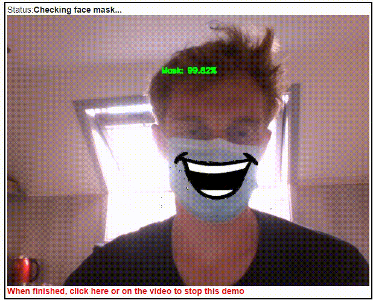

# Open in Colab

[](https://colab.research.google.com/github/dubjap/Intelligent-Interface-project/blob/main/Main.ipynb)

# Intelligent-Interface-project
This project is in the content of the course 'intelligent interfaces' in the studies of the postgraduate 'applied AI' at the Erasmus hogeschool Brussels.

The **Goal** of the project is detecting a facemask in a video, replace it with a mouth and make the mouth move on the sound that is given.

# References

The project is purely for education purposes and thus strongly based on already existing models and repos.

## Facemask Detection

* [Facemask Dataset](https://www.kaggle.com/mloey1/medical-face-mask-detection-dataset)
* [Trained model facemask detection](https://github.com/balajisrinivas/Face-Mask-Detection)
* [Documentation on facemask detection](https://www.pyimagesearch.com/2020/05/04/covid-19-face-mask-detector-with-opencv-keras-tensorflow-and-deep-learning/)

## Remove Facemask
* [mask2face](https://github.com/strvcom/strv-ml-mask2face)

## Lip sync
* [Wav2Lip](https://github.com/Rudrabha/Wav2Lip)


# Facemask detection

The code is implemented in colab, the project should be fully able to work as stand alone in Colab.

The trained models are here in the git and will be uploaded in the notebook at Colab.

It will detect the facemask and place a mouth on top of it



# Run wave2lip

In the next part the face is synced to the sound. For this the [Wav2Lip](https://github.com/Rudrabha/Wav2Lip) is used.
This is not (yet) in Colab but runs locally. 

```
python inference.py --checkpoint_path C:\Users\Jasper\Desktop\intelligent-interfaces\Wav2Lip-master\Wav2Lip-master\checkpoints\wav2lip_gan.pth --face C:\Users\Jasper\Desktop\intelligent-interfaces\Wav2Lip-master\Media9.mp4 --audio C:\Users\Jasper\Desktop\intelligent-interfaces\Wav2Lip-master\bazigar_part1.wav
```

